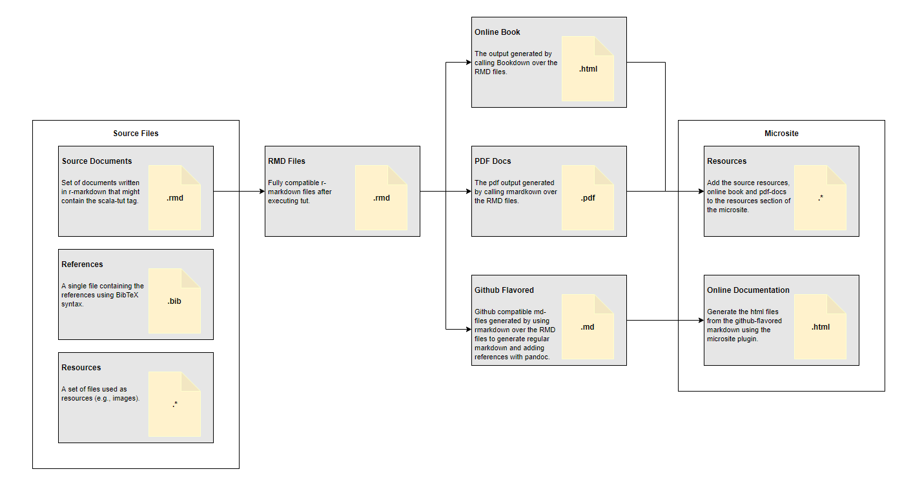
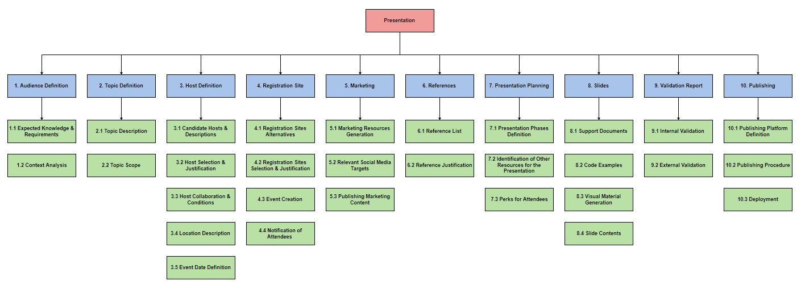
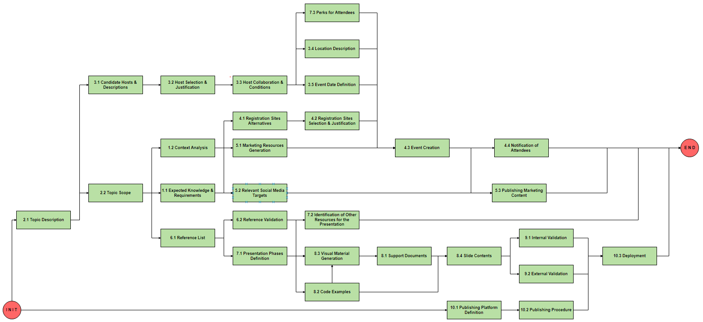

# What is this?

```{r setup-what-is-this, include=FALSE}
reticulate::use_virtualenv(file.path(getwd(), 'venv'))
```

## The Short Answer

**Q**: What is this?

**A**: A site where I host and publish the documentation and reference materials for my talks.

## The Long Answer

### Motivation

Have you ever feel limited by the "expressiveness" of the documentation tools you use (e.g., simple markdown)? Or frustrated by the complexity they might introduce (e.g., latex)? Well, this situation inspired me to enter a quest to find the best technical writing tool for (software) engineers that's simple enough to learn, has a lightweight syntax, and avoids unnecessary complexity and boilerplate. I recently concluded that such a tool doesn't exist (but could!). 

Since [my background] is on machine learning and data engineering, I was looking for something that can parse mathematical equations and at the same time, execute arbitrary code snippets. In particular, I was looking for: 

[my background]: https://www.linkedin.com/in/rhdzmota/ 

* **A expressive but straightforward syntax for formatting.** We all know that [LaTeX] is the king for document formatting, but introduces significant boilerplate for small projects. On the other hand, [markdown] is very simple but compromises expressiveness. 
* **Ability to parse and present math equations.** This is the main reason I keep coming back to LaTeX. Is there a way out?  
* **Ability to execute arbitrary code snippets in several languages.** I don't ask for much. As an engineer specialized on the [data fields], I expect to be able to run at least [Scala], [Python], and [Bash].
* **Being able to use a single-source document to generate multiple outputs formats.** I might want to share the same document as a PDF, or a webpage. 
* **Reference management simplification.** Nice to have! 

[LaTeX]: https://www.latex-project.org/
[markdown]: https://en.wikipedia.org/wiki/Markdown
[data fields]: https://www.oreilly.com/ideas/data-engineers-vs-data-scientists
[Scala]: https://www.scala-lang.org/ 
[Python]: https://www.python.org/ 
[Bash]: https://www.gnu.org/software/bash/

Fortunately, there are plenty of open source tools that aim to solve particular doc-oriented problems. My solution turned out to be a **giant hack** that combines several of these tools.

### The proposed approach

You might be reading this document on a website, pdf-file, or even an ebook. A single source file generated all of these outputs. Let's be clear; this is not magic. It's the result of using several high-quality open source projects. In particular, I want to express my appreciation to all the collaborators of the following projects: 

* [Pandoc] - a Haskell based universal document converter.
* [Rmarkdown] - a tool for reproducible research that allows computing code and narrative to be in the same document. 
* [Bookdown] - an Rmarkdown extension. 
* [Scala Tut] - an SBT plugin that allows executable scala-code snippets in Markdown. 
* [Scala Microsite] - an SBT plugin that allows the creation of microsites.

[Pandoc]: https://pandoc.org/
[Rmarkdown]: https://rmarkdown.rstudio.com/
[Bookdown]: https://bookdown.org/yihui/rmarkdown/
[Scala Tut]: http://tpolecat.github.io/tut/
[Scala Microsite]: https://47deg.github.io/sbt-microsites/

Let me explain how to combine all these tools into a giant hack:


\ 

Find a naive implementation of this process in the [github repo] that contains the source code for this site. 

[github repo]: https://github.com/rhdzmota/presentations

### Why R markdown?

As you might have noticed, this Frankenstein tool relies mostly on R-markdown for the most relevant features. Let me cite the author of the Bookdown framework to explain my decision: 

> "R Markdown may not be the right format for you if you find these elements not enough for your writing: paragraphs, (section) headers, block quotations, code blocks, (numbered and unnumbered) lists, horizontal rules, tables, inline formatting (emphasis, strikeout, superscripts, subscripts, verbatim, and small caps text), LaTeX math expressions, equations, links, images, footnotes, citations, theorems, proofs, and examples."

[@xie2018r]

### Publishing

The SBT microsite plugin facilitates the deployment of the resulting site into [github pages]. This service can host and serve static sites without a problem by using Jekyll. 

I use a custom script that execute the whole pipeline:

* `./publish --local`: serve the site in localhost. 
* `./publush --site`: serve the site in github pages. 

Note that you must run the `setup` scripts before. 

[github pages]: https://pages.github.com/
[Jekyll]: https://jekyllrb.com/

### Presentations

We can represent the project of generating a presentation with a work-breakdown structure diagram (WBS).


\ 

To represent the dependencies, we can take the "leaves of the tree" and arrange them in a network diagram. 


\ 

## References
