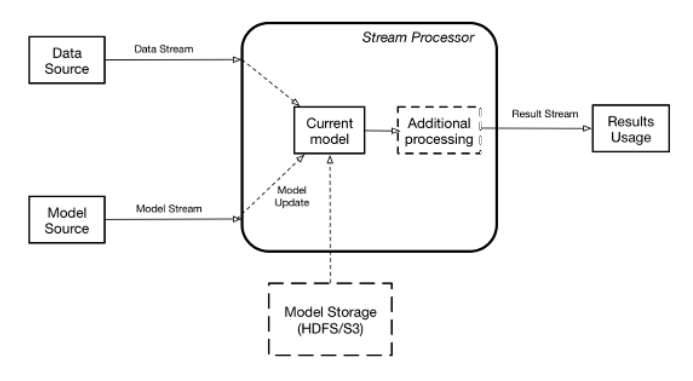

# End-to-End ML with Apache Spark

```{r setup-end-to-end-sparkml, include=FALSE}
reticulate::use_virtualenv(file.path(getwd(), 'venv'))
```

## Outline

1. ML Project Overview
2. Operationalizing
3. Spark-Based Projects
4. Code Example!

## Starting Questions

* Who in here is a Data Professional (e.g., scientist, engineer)?
* How many of you have used Apache Spark? in production?
* How many of you are currently developing/maintaining a ML service?

## Acknowledgments

This talk is based and inspired on the following conferences:

* [Operationalizing Machine Learning - Serving ML Models] by Boris Lublinsky
* [Concept Drift: Monitoring Model Quality in Streaming Machine Learning Applications] by Emre Velipasaoglu 
* [R, Scikit-Learn, and Apache Spark ML: What Difference Does It Make?] by Villu Ruusmann

[Operationalizing Machine Learning - Serving ML Models]: https://www.youtube.com/watch?v=SNxMLINtlbo
[Concept Drift: Monitoring Model Quality in Streaming Machine Learning Applications]: https://www.youtube.com/watch?v=woRmeGvOaz4 
[R, Scikit-Learn, and Apache Spark ML: What Difference Does It Make?]: https://www.youtube.com/watch?v=CdVXEQgmnfY

Find the complete list of references in the **References** section.

## Prerequisites

This talk assumes you are a machine learning enthusiast or a data-professional (e.g. scientist, engineer) that is well aware the basic concepts required to design and execute an ML-project.

The audience must have a workable understanding of: 

* Main programming languages used in the data-sphere (i.e. [scala], [python], [R])
* General understanding of data architecutres (e.g. batch-oriented, streaming)
* Machine Learning theory (i.e., lots of math).
* Machine Learning frameworks (e.g., [Spark ML], [Tensorflow], [PyTorch])
* Data-related skills (e.g., cleaning, visualization)

[scala]: https://www.scala-lang.org/
[python]: https://www.python.org/
[R]: https://www.r-project.org/
[Spark ML]: http://spark.apache.org/mllib/
[Tensorflow]: https://www.tensorflow.org/
[PyTorch]: https://pytorch.org/

## ML Project Overview 

Typically with a ML Project, different groups are responsible for model training and serving. Moreover, the data science toolbox is constantly evolving, pushing software engineers to create more model-serving frameworks and introducing complexity to the development pipeline. 

Consider the following machine-learning pipeline: 


\

Machine Learning Cycle. 

### What's a ML Model? 

We will use the idea of a model as just a function `f` that transforms a set of inputs `x` into outputs `y` (i.e. `y = f(x)`).

This definition allows us to apply functional composition in the implementation of our ML service. 

With this is mind, we can introduce the concept [machine learning pipelines ] as a graph defining a chain of operations (e.g., data transformations):


\

Why is it important to define a pipeline? To encapsulate all the logic needed to serve the machine learning model. This formalizes the pipeline form the input data to the output. 

## Operationalizing 

### Traditional Approach

Traditionally, the machine learning model was viewed as code. This code had to be somehow imported for serving in production. 


\

Impedance mismatch! 

### A simple solution

We can shift our thinking from a "code" perspective to a "data" perspective and represent the model using a standard specification that's agnostic to the training process. We can use the PMML specification designed by the [Data Mining Group](http://dmg.org/) to achieve this. 

Predictive Markdown Model Language is:

> "an XML-based language that provides a way for applications to define statistical and data-mining models as well as to share models between PMML-compliant applications." 

[@pmml2017uusmann]

Integration with the most popular ML frameworks via JPMML:

* [jpmml-sparkml](https://github.com/jpmml/jpmml-sparkml)
* [jpmml-sklearn](https://github.com/jpmml/jpmml-sklearn)
* [jpmml-r](https://github.com/jpmml/jpmml-r)
* [jpmml-xgboost](https://github.com/jpmml/jpmml-xgboost)
* [jpmml-tensorflow](https://github.com/jpmml/jpmml-tensorflow)

Using these tools we can achieve:


\

Simple Scoring.

### Best Practice

We can use either a stream-processing engine (SPE e.g., Apache Spark, Flink) or a stream-processing library (SPL e.g., Akka Stream, Kafka Stream).

 
\

Suggested architecture.

* SPE: Good fit for applications that require features provided out of the box by such engines. 
* SPL: Provide a programming model highly customizable and light-weight. 

[@servingml2017boris]
 
We can use [Akka Streams] - based on [Akka Actors], to implement the proposed architecture (see [syntax example](https://github.com/RHDZMOTA/cnap-policy-crawler)). The result would look like this: 


[Akka Streams]: https://doc.akka.io/docs/akka/2.5/stream/
[Akka Actors]: https://doc.akka.io/docs/akka/2.5/guide/tutorial_1.html


Simple Akka Implementation

Furthermore, we can enhance this approach by using Akka Clusters. 


Akka Cluster Implementation

### The Big Picture

Dean Wampler does a fantastic job describing the overall picture of a data-driven system architecture. 


\

Big Picture Architecture
    
[@fastdata2017dean]

## Spark-Based Projects

### Why Apache Spark? 

According to their website, 

> "[Apache Spark] is a unified analytics engine for large-scale data processing."

[Apache Spark]: https://spark.apache.org/

According to the book "High Performance Spark - Best Practices for Scaling & Optimizing Apache Spark": 

> "Apache Spark is a high-performance, general puropose distributed computer system. Spark enables us to process large quantities of data, beyond what can fit on a sinlge machine, with a high-level, relatively easy-to-use API. Uniquely, Spark allows us to write the logic of data transformations and machine learning algorithms in a way that is parallelizable, but relatively system agnostic."

[@karau2017high]

Most of the Apache Spark features revolve around a base data-structure called [RDD]s (resilient distributed datasets). An RDD is a fault-tolerant collection of elements that can be operated on parallel.  

[RDD]: https://spark.apache.org/docs/latest/rdd-programming-guide.html#resilient-distributed-datasets-rdds


Let's initialize an Spark Session (sbt console: `sbt -Dscala.color "content/console"`):

```tut:silent
import org.apache.spark.sql.SparkSession

val spark = 
  SparkSession.builder.appName("Example!").config("spark.master", "local[*]").getOrCreate()

import spark.implicits._
```

By default, the number of partitions is the number of all available cores [@laskowski2017mastering]: 

```tut:book
spark.sparkContext.defaultParallelism
```

We can test this by creating a simple Dataset from a list: 

```tut:silent

trait Person

object Person {
  final case class Dead(name: String, birthYear: Int, deadYear: Int) extends Person {
      def kill: Dead = this
    }

  final case class Alive(name: String, birthYear: Int) extends Person {
    def kill: Dead = Dead(name, birthYear, 2019)
  }
  
  val names: List[String] = List(
    "Data Ninja",
    "Random Developer",
    "Pizza Lover",
    "Beer Lover"
  )

  val years: List[Int] = (1980 to 2000).toList

  def getRandomElement[A](ls: List[A]): A = 
    ls(scala.util.Random.nextInt(ls.size))

  def getRandom: Alive = Alive(getRandomElement(names), getRandomElement(years))
}

val people: List[Person.Alive] = (1 to 1000).toList.map(i => Person.getRandom)
```

We can now create a `Dataset[Person]`:

```tut:silent
import org.apache.spark.sql.Dataset

val alivePeople: Dataset[Person.Alive] = spark.createDataset(people)
```

The number of partitions on this dataset: 

```tut:book
alivePeople.rdd.partitions.size
```

```tut:book
val deadPeople: Dataset[Person.Dead] = 
  alivePeople.filter(_.birthYear > 1994).map(person => person.kill)

deadPeople.show()
```

```tut:silent
spark.close()
```

For performance reasons, this presentation will use the official Scala API.

### Intro to Spark ML

Spark ML is a practical and scalable machine learning library based on a [Dataset]. A Dataset is a distributed collection of data with interesting features such as strong typing, lambda functions, and with the advantages of the Spark SQL's optimized execution engine. We can manipulate a dataset with functional transformantions. The most basic ones: 

* map     - `Dataset[A].map(fn: A => B): Dataset[B]`
* flatMap - `Dataset[A].flatMap(fn: A => Dataset[B]): Dataset[B]`
* filter  - `Dataset[A].filter(fn: A => Boolean): Dataset[A]` 

One of the most usefull abstractions available on the Spark ML package are pipelines. Main concepts: 

* `Dataset[Row]`: A set of data, also called dataframe. Each row usually represents an observation. 
* `Transformer`: an algorithm that takes one `DataFrame` and returns another `DataFrame`. 
* `Estimator`: an algorithm that takes a `DataFrame` and returns a `Transformer`.
* `Pipeline`: a chain of multiple `Transformer` or `Estimator`. 


### Intro to JPMML and Openscoring

Data Scientist might use Python and R for exploration and modeling while software engineers use Scala, Java, or Go for the system architecture. Complexity arises when dealing with multiple runtimes and trying to integrate the data solutions into the system. One way to standardize this interaction is via PMML: Predictive Markdown Model Language. 

To use the jpmml-sparkml library, just add the following dependency to your sbt file:

```scala
"org.jpmml" % "jpmml-sparkml" % "1.4.5"
```

Now we can just take a Spark `PipelineModel` and create a PMML object:

```scala
val pmmlBuilder = new PMMLBuilder(schema, pipelineModel)
pmmlBuilder.build()
```

See the official [jpmml-sparkml github repo] for a complete list of supported `PipelineStages` types. 

[jpmml-sparkml github repo]: https://github.com/jpmml/jpmml-sparkml

We can use [Openscoring], a java-based REST web-service, as our scoring-engine of the resulting PMML model.

[Openscoring]: https://github.com/openscoring/openscoring

* Simple but powerful API
* Allows for single predictions and for batch predictions. 
* Acceptable performance (usually sub-milliseconds respond time)

Model REST API endpoints:

| HTTP method | Endpoint | Required role(s) | Description |
| ----------- | -------- | ---------------- | ----------- |
| GET | /model | - | Get the summaries of all models |
| PUT | /model/${id} | admin | Deploy a model |
| GET | /model/${id} | - | Get the summary of a model |
| GET | /model/${id}/pmml | admin | Download a model as a PMML document |
| POST | /model/${id} | - | Evaluate data in "single prediction" mode |
| POST | /model/${id}/batch | - | Evaluate data in "batch prediction" mode |
| POST | /model/${id}/csv | - | Evaluate data in "CSV prediction" mode |
| DELETE | /model/${id} | admin | Undeploy a model |
 


\

Complexity vs dataset size. 

[@pmml2017uusmann]

## Code Example!

### Download the data

We can use the Gutenberg Project as a data-source for our ML task. To download the complete content of the gutenberg project as a set of txt-files run the following bash-command:

```bash
curl -sSL https://raw.githubusercontent.com/RHDZMOTA/spark-wordcount/develop/gutenberg.sh | sh
```

Depending on your network speed this can take up to 3 hours.

Let's figure out the "footprint" of this dataset:

* Number of books: `ls -l gutenberg | wc -l`
* Data size: `du -sh gutenberg`

Consider taking a random sample to facilitate local development. The following command generates a sample of 5K books:

```bash
mkdir gutenberg-sample && ls gutenberg/ | shuf -n 5000 | xargs -I _ cp gutenberg/_ gutenberg-sample/_
```

Printing the results. 

```bash
echo "There are $(ls -l gutenberg | wc -l) books that represent: $(du -sh gutenberg)"
```

### Minimum Setup

1. Install [Java 8] or greater.
    * Debain-based OS: `sudo apt install openjdk-8-jdk`
2. Install the [Scala Build Tool] (SBT)
    * Debian-based OS:

```bash
$ sudo apt install wget
$ wget https://dl.bintray.com/sbt/debian/sbt-1.2.6.deb
$ sudo dpkg -i sbt-1.2.6.deb
$ rm -r sbt-1.2.6.deb
$ sbt about
```

### WordCount

Let's do a quick wordcount example on the dataset as a warm-up exercise:

```scala
import com.rhdzmota.presentations.Settings.S03
import com.rhdzmota.presentations.S03.config.Context
import org.apache.spark.sql._

object WordCount extends Context {
  import spark.implicits._

  final case class WordCount(word: String, count: Long)

  val data: Dataset[String] = spark.read.textFile(S03.Data.source)

  val wordcount: Dataset[WordCount] = data
    .flatMap(_.split("""\s+""")).map(_.toLowerCase.replaceAll("[^A-Za-z0-9]", "")).filter(_.length > 1)
    .groupByKey(identity).count().map({case (w, c) => WordCount(w, c)})
    .sort($"count".desc)

  def main(args: Array[String]): Unit = {
    println("S03 WordCount Application")
    wordcount.show()
    spark.close()
  }
}
```

Run:

```scala
WordCount.main(Array[String]())
```

Or:

```bash
sbt "content/runMain com.rhdzmota.presentations.S03.WordCount" 
```

### Next Word Prediction

The challenge we have consists con taking an n-set of books and create a model that's capable of predicting the next word given a context of the last m-words. 

A similar approach is performed for generating [word embeddings] based on the distributional hypothesis - words that appear in the same contexts share semantic meaning.

[word embeddings]: https://www.tensorflow.org/tutorials/representation/word2vec 

### Openscoring Container

We can easily leverage Openscoring with Docker. 

Consider the following `Dockerfile`:

```docker
FROM maven:3.5-jdk-8-alpine

RUN apk update && apk upgrade && apk add --no-cache bash ca-certificates wget openssh

RUN wget https://github.com/openscoring/openscoring/releases/download/1.4.3/openscoring-server-executable-1.4.3.jar

ADD application.conf application.conf

ENTRYPOINT java -Dconfig.file=application.conf -jar openscoring-server-executable-1.4.3.jar

EXPOSE 8080

CMD []

```

And the following `application.conf` file: 

```text
application {
  // List of JAX-RS Component class names that must be registered
  componentClasses = [
    "org.openscoring.service.filters.NetworkSecurityContextFilter",
    "org.openscoring.service.filters.ServiceIdentificationFilter"
  ]
}

networkSecurityContextFilter {
  // List of trusted IP addresses. An empty list defaults to all local network IP addresses.
  // A client that originates from a trusted IP address (as indicated by the value of the CGI variable REMOTE_ADDR) is granted the "admin" role.
  trustedAddresses = ["*"]
}
```

We can create our custom image with:  

```bash
docker build -t next-word-demo/openscoring resources/provided/docker/
```

Now we can run a docker container with: 

```bash
docker run -p 8080:8080 -d --name next-word-engine next-word-demo/openscoring
```

You can test this service is running by going to: `http://{ip-address}:8080/openscoring` where `ip-address` is your `docker-machine ip` or `localhost`. We can now upload the resulting dataset to the Openscoring API:

```bash
curl -X PUT --data-binary @resources/output/model/2019-01-25T01-07-14.836-89d19488-3d3d-483c-a2f0-47caf685d7db-96.pmml \
-H "Content-type: text/xml" \
http://192.168.99.100:8080/openscoring/model/next-word
```

We should see the model in `http://{ip-address}:8080/openscoring/model/next-word-demo`.

Enjoy your scoring!

```bash
curl -X POST --data-binary @resources/provided/requests/req-01.json \
    -H "Content-type: application/json" \
    http://192.168.99.100:8080/openscoring/model/next-word \
    | jq '.result."pmml(prediction)"'
```

## References
