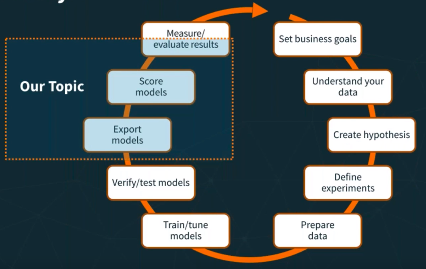
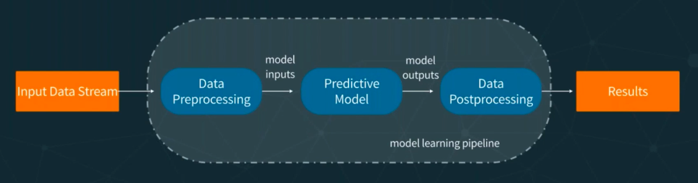
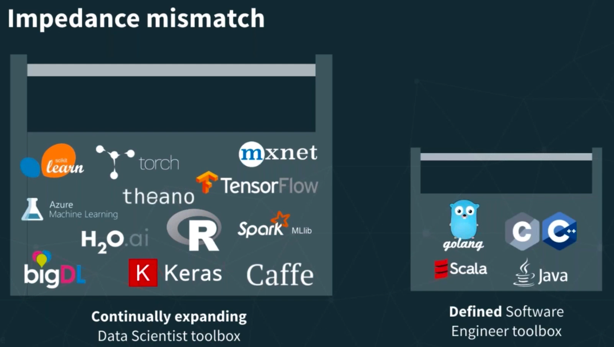
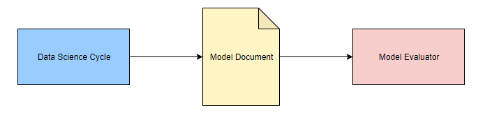
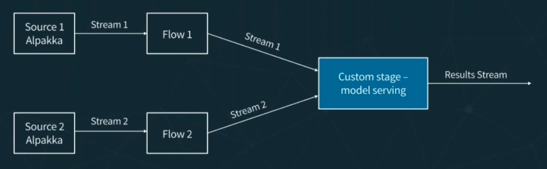
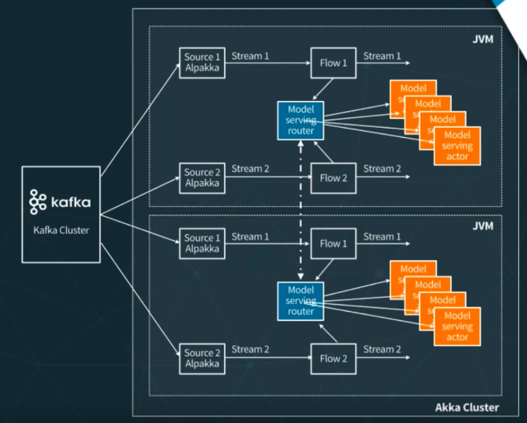
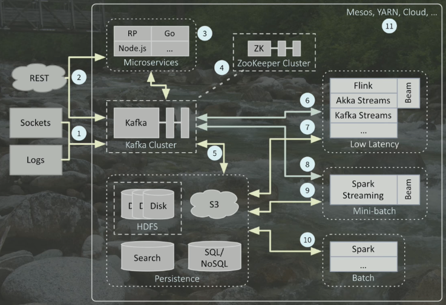

### `whoami`

@[rhdzmota]

Data Engineer / Scientist at [LeadGenius]

[rhdzmota]: https://twitter.com/rhdzmota
[LeadGenius]: http://leadgenius.com

------

## Agenda

1. ML Project Overview
2. Operationalizing
3. Spark-Based Projects
4. Code Example!

------

### Acknowledgments

* [Operationalizing Machine Learning - Serving ML Models] by Boris Lublinsky
* [Concept Drift: Monitoring Model Quality in Streaming Machine Learning Applications] by Emre Velipasaoglu 
* [R, Scikit-Learn, and Apache Spark ML: What Difference Does It Make?] by Villu Ruusmann

[Operationalizing Machine Learning - Serving ML Models]: https://www.youtube.com/watch?v=SNxMLINtlbo
[Concept Drift: Monitoring Model Quality in Streaming Machine Learning Applications]: https://www.youtube.com/watch?v=woRmeGvOaz4 
[R, Scikit-Learn, and Apache Spark ML: What Difference Does It Make?]: https://www.youtube.com/watch?v=CdVXEQgmnfY

------

## ML Project Cycle



------

## ML Pipelines




------

## Operationalizing 

------

### Traditional Approach



------

### A simple solution

Predictive Markdown Model Language is:

> "an XML-based language that provides a way for applications to define statistical and data-mining models as well as to share models between PMML-compliant applications." 

------

### PMML Interop

Integration with the most popular ML frameworks via JPMML:

* [jpmml-sparkml](https://github.com/jpmml/jpmml-sparkml)
* [jpmml-sklearn](https://github.com/jpmml/jpmml-sklearn)
* [jpmml-r](https://github.com/jpmml/jpmml-r)
* [jpmml-xgboost](https://github.com/jpmml/jpmml-xgboost)
* [jpmml-tensorflow](https://github.com/jpmml/jpmml-tensorflow)

------

### Simple Solution using PMML



------

### Best Practice

We can perform model scoring either with a stream-processing engine or a stream-processing library. 

 

------

### Best Practice - Akka Aproach

We can use [Akka Streams] - based on [Akka Actors] (see [syntax example](https://github.com/RHDZMOTA/cnap-policy-crawler)).



[Akka Streams]: https://doc.akka.io/docs/akka/2.5/stream/
[Akka Actors]: https://doc.akka.io/docs/akka/2.5/guide/tutorial_1.html

------

### Akka Cluster



------

### The Big Picture



------

## Spark-Based Projects

------

### Why Apache Spark? 

According to their website, 

> "[Apache Spark] is a unified analytics engine for large-scale data processing."

[Apache Spark]: https://spark.apache.org/

------

### Intro to Spark ML

Spark ML is a practical and scalable machine learning library based on a [Dataset].

* `Dataset[A].map(fn: A => B): Dataset[B]`
* `Dataset[A].flatMap(fn: A => Dataset[B]): Dataset[B]`
* `Dataset[A].filter(fn: A => Boolean): Dataset[A]` 

------

### Relevant Concepts

* `Dataset[Row]` 
* `Transformer`
* `Estimator`
* `Pipeline`

------

### Intro to JPMML 

```scala
val pmmlBuilder = new PMMLBuilder(schema, pipelineModel)
pmmlBuilder.build()
```

See the official [jpmml-sparkml github repo] for a complete list of supported `PipelineStages` types. 

[jpmml-sparkml github repo]: https://github.com/jpmml/jpmml-sparkml

------

### Intro to Openscoring

We can use [Openscoring], a java-based REST web-service, as our scoring-engine of the resulting PMML model.

[Openscoring]: https://github.com/openscoring/openscoring

* Simple but powerful API
* Allows for single predictions and for batch predictions. 
* Acceptable performance (usually sub-milliseconds respond time)

------

## Demo Time! 
